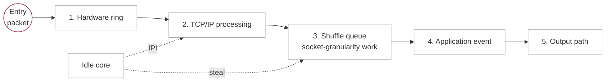
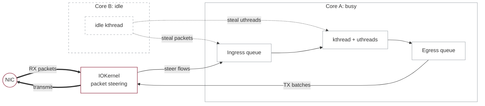

## Background

Many online applications no longer run as one program on one machine. They are split into services so that different parts of the system can scale independently and handle large numbers of users and requests. A single user request may therefore enter through a gateway and then trigger several remote procedure calls (RPCs) to backend services over the network.

Once a request crosses service boundaries, latency becomes an end-to-end budget rather than a property of one machine. Developers often describe this budget with a service-level objective (SLO), which defines the response-time target a request should meet. In systems such as memcached, the useful work for a request may take only a few microseconds, so even small scheduling and networking overheads matter.

The central tension is that the system wants two things at once. It wants to keep each request within its SLO, especially during overload, but it also wants to keep CPUs highly utilized instead of reserving large amounts of idle capacity. That tension comes from two sources: workload variability and the mismatch between modern network bandwidth and operating-system overhead.

## Problem 1: Workload

The latency of each service is affected by several factors. Request arrivals can be bursty, diurnal, or otherwise uneven. Once the arrival rate exceeds server capacity, queues build up. Later requests then suffer from head-of-line blocking and risk violating their SLOs unless more resources are provisioned.

One straightforward response is to overprovision resources so queues are less likely to build. However, this wastes capacity. If developers provision enough machines so overload almost never happens, utilization during normal periods can be poor. It is expensive to maintain a large cluster of underutilized machines.

Service latency can also change because of the application itself. Events such as cache misses or reconnections can make a request take longer than expected. Less time-sensitive work, such as garbage collection, may also contend with latency-sensitive tasks for the same cores. Again, the common response is to add more resources, which leads back to the same underutilization problem.

## Problem 2: Kernel Efficiency

The operating systems widely used in production are not always well matched to current network hardware. From queueing theory, a single queue shared by multiple processors can perform better than one queue per processor. Processor sharing is also attractive for high-dispersion tasks because long tasks do not strand short ones behind them. In practice, however, real systems do not match the theory neatly.

As Amy Ousterhout discusses in her talk, network bandwidth has increased dramatically over the past decades. The network is now fast enough that the operating system can become the bottleneck. Receiver-side scaling (RSS) is often used to improve throughput by steering packets from the network interface card (NIC) directly to CPU cores, rather than routing all work through one centralized queue.

This improves throughput, but it also departs from the theoretically attractive shared-queue design. Linux without kernel bypass keeps a more centralized model, but it incurs high overheads for microsecond-scale tasks because scheduling is too coarse-grained. Kernel-bypassing systems improve throughput, but they often introduce the drawbacks of one queue per core: poor work conservation and head-of-line blocking. A per-core strategy works best for short, low-dispersion tasks. Otherwise, one worker can sit idle while another remains overloaded.

Work stealing is a natural response to this imbalance. Each worker keeps a local queue of pending tasks, and idle workers steal tasks from the opposite end of another worker's queue. In principle, this makes the system work-conserving while requests are in flight. The intuition is simple, but ordinary work stealing is not immediately useful at microsecond scale because its overheads, including context switches and stack management, can be too large.

## Work Stealing -- ZygOS

ZygOS tries to recover the work-conservation benefits of a centralized queue while keeping much of the performance of a kernel-bypass, shared-nothing dataplane. It does this by introducing an intermediate shared buffer, called the shuffle queue, between networking and application execution. The shuffle queue creates a controlled place where work can be stolen across cores.

This is the key tradeoff. Unlike IX, ZygOS is not fully cache-coherence free: work stealing requires some sharing, and sharing introduces synchronization and cache-coherence costs. ZygOS accepts this cost in a narrow part of the system so it can reduce head-of-line blocking and improve work conservation.

### Three-level design of ZygOS

The data flow in ZygOS has three layers: the networking layer, the shuffle layer, and the application layer. The networking layer receives packets and performs protocol processing on each core. The shuffle layer decides whether work is consumed by its home core or stolen by another core. The application layer manages the interaction between the application and the kernel-bypass runtime.

The packet lifecycle is roughly:

1. Dequeue from the hardware ring to the software ring
2. Process the packet in the TCP/IP stack, then place the connection at the back of the shuffle queue
3. Dequeue from the shuffle queue and deliver the corresponding event to the application
4. Allow the application to call back into the networking stack, for example to transmit data or manage timers

This is the normal path when no core is idle. When a core becomes idle, it can fetch work from another core's shuffle queue. Any resulting networking-stack work is then enqueued back on the connection's home core, preserving ownership where it matters.

### Socket ownership

Socket ordering becomes subtle when multiple threads can access the same connection. Without care, concurrent access can break request parsing, produce out-of-order responses, or require heavy synchronization. ZygOS avoids this by using an ownership model: at any point, one thread owns exclusive access to a socket.

After TCP/IP processing, incoming packets are grouped by socket in the shuffle queue. The socket, rather than an individual packet, becomes the unit of stealing. This keeps events related to the same socket implicitly ordered while still allowing work to move between cores.

### Inter-processor interrupts

The shuffle queue helps eliminate head-of-line blocking inside the scheduling layer, but head-of-line blocking can still appear before or after it. For example, packets may be waiting in the NIC hardware queue while the corresponding core is busy running application code. If the shuffle queue is empty, another idle core has nothing to steal even though work exists upstream.

ZygOS uses inter-processor interrupts (IPIs) to address this case. An idle core can interrupt a remote core and force it to run the networking stack, replenishing the shuffle queue with stealable work. A similar issue appears for remote batched system calls, where queued work may need a prompt nudge to become visible to the rest of the scheduler.

### Summary

ZygOS brings work stealing into a kernel-bypass design. This directly addresses two causes of high tail latency in shared-nothing dataplanes: poor work conservation and head-of-line blocking. The cost is that ZygOS has to introduce carefully controlled sharing through the shuffle queue.

However, ZygOS still assumes a relatively static allocation of cores. This leaves a second efficiency problem unresolved. To absorb bursty workloads, an application may still need many idle cores waiting for future demand. Linux can dynamically reallocate cores, but it does so at millisecond timescales, which is far slower than microsecond-scale requests. Shenango focuses on this mismatch between allocation granularity and workload granularity.

## Fast Core Allocation -- Shenango

Shenango studies a related problem, but shifts the emphasis from work conservation within one application to resource efficiency across applications. As discussed earlier, systems often overprovision cores to preserve microsecond-scale tail latency under bursty load. Kernel-bypass systems can improve throughput, but they may still waste CPU cycles polling the NIC or keeping cores idle for bursts that may not arrive.

The key observation in Shenango is that spare cores are useful, but they do not need to be permanently assigned. If the system can move cores quickly enough, it can keep fewer cores idle while still reacting to short bursts.

Dynamic core allocation is not new. Linux and systems such as IX or Arachne can also rebalance cores, but they operate at millisecond or tens-of-milliseconds timescales. That is too slow for microsecond-scale work, so applications must still reserve extra cores to protect tail latency.

Fast core allocation has two main questions:

1. How can the system tell that an application needs more cores?
2. How can it reassign cores with low enough overhead to matter at microsecond scale?

Shenango answers these questions with an IOKernel, a dedicated kernel-bypass component that sits between the NIC and applications and manages core allocation.

### IOKernel

The IOKernel has two responsibilities:

1. Minimize the number of idle cores the system needs to reserve
2. Reallocate cores to applications with low overhead

In the control path, the IOKernel decides how many cores each application should receive. In the data path, it steers incoming packets from the NIC into application shared-memory queues, polls application egress queues, and forwards outgoing packets back to the NIC. The first step in the control path is detecting congestion quickly enough to respond before queues become large.

#### Congestion Detection Algorithm

Shenango uses a simple congestion signal. If a packet remains in an application's queue across two checks separated by five microseconds, the application is considered congested. Shenango avoids using queue length directly because queue-length thresholds would require additional tuning parameters.

> **Remark**: Treating five microseconds of queueing as congestion is implementation-friendly and keeps queues short. One question is whether relaxing this threshold could improve CPU efficiency while still protecting tail latency.

#### Core Selection Algorithm

Core selection has two sides. If idle cores exist, Shenango should allocate an idle core rather than preempting a busy one. If no idle core is available, the scheduler should avoid arbitrary preemption and instead choose a core that minimizes disruption.

Shenango therefore prefers cores that are likely to have low switching cost, such as logical cores sharing the same physical core or cores that already have useful application state in cache. Both congestion detection and core selection run at five-microsecond granularity and have linear complexity in the number of cores, which makes microsecond-scale reallocation practical.

This raises a useful design question: is five microseconds too frequent? Shenango chooses this aggressive interval to protect latency, but the tradeoff between responsiveness and allocation overhead is exactly where resource efficiency becomes interesting.

#### Runtime Work Stealing 

In Shenango's runtime, each core is bound to a kernel thread (`kthread`) and has a run queue of user-level threads (`uthreads`). This creates a familiar problem: when one application uses multiple cores, separate per-core run queues can again cause head-of-line blocking and poor work conservation.

Shenango applies work stealing to user-level threads to reduce tail latency. It also allows `kthreads` to steal packets from remote ingress queues before TCP/IP processing. This is finer-grained than ZygOS, which steals socket work after TCP/IP processing, but it can introduce packet reordering.

To handle reordering efficiently, Shenango relaxes the ordering requirement and uses a per-socket lock before TCP processing. The assumption is that packets from the same flow usually arrive at the same core over short timescales, so the lock overhead remains low and cache locality is mostly preserved. Compared with ZygOS, Shenango avoids using IPIs to force timely ingress processing, which helps keep CPU overhead lower.

### Summary

Shenango expands the picture from work conservation to resource efficiency. Its IOKernel reallocates cores at microsecond scale, using fast congestion detection and low-overhead core selection to reduce the number of idle cores needed for bursty workloads. At runtime, Shenango also uses finer-grained work stealing than ZygOS, stealing both `uthreads` and packets to reduce tail latency.

## Mitigating Interference -- Caladan

## References

- [ZygOS: Achieving Low Tail Latency for Microsecond-scale Networked Tasks](https://marioskogias.github.io/docs/zygos.pdf)
- [Shenango: Achieving High CPU Efficiency for Latency-sensitive Datacenter Workloads](https://www.usenix.org/conference/nsdi19/presentation/ousterhout)
- [Caladan: Mitigating Interference at Microsecond Timescales](https://www.usenix.org/conference/osdi20/presentation/fried)
