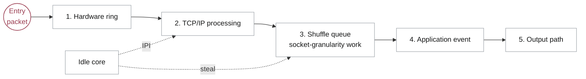

## Background

Many online applications no longer run as one program on one machine. They are split into services so that different parts of the system can scale independently and handle large numbers of users and requests. A single user request may therefore enter through a gateway and then trigger several remote procedure calls (RPCs) to backend services over the network.

Once a request crosses service boundaries, latency becomes an end-to-end budget rather than a property of one machine. Developers often describe this budget with a service-level objective (SLO), which defines the response-time target a request should meet. In systems such as memcached, the useful work for a request may take only a few microseconds, so even small scheduling and networking overheads matter.

The central tension is that the system wants two things at once. It wants to keep each request within its SLO, especially during overload, but it also wants to keep CPUs highly utilized instead of reserving large amounts of idle capacity. That tension comes from two sources: workload variability and the mismatch between modern network bandwidth and operating-system overhead.

## Problem 1: Workload

The latency of each service is affected by several factors. Request arrivals can be bursty, diurnal, or otherwise uneven. Once the arrival rate exceeds server capacity, queues build up. Later requests then suffer from head-of-line blocking and risk violating their SLOs unless more resources are provisioned.

One straightforward response is to overprovision resources so queues are less likely to build. However, this wastes capacity. If developers provision enough machines so overload almost never happens, utilization during normal periods can be poor. It is expensive to maintain a large cluster of underutilized machines.

Service latency can also change because of the application itself. Events such as cache misses or reconnections can make a request take longer than expected. Less time-sensitive work, such as garbage collection, may also contend with latency-sensitive tasks for the same cores. Again, the common response is to add more resources, which leads back to the same underutilization problem.

## Problem 2: Kernel Efficiency

The operating systems widely used in production are not always well matched to current network hardware. From queueing theory, a single queue shared by multiple processors can perform better than one queue per processor. Processor sharing is also attractive for high-dispersion tasks because long tasks do not strand short ones behind them. In practice, however, real systems do not match the theory neatly.

As Amy Ousterhout discusses in her talk, network bandwidth has increased dramatically over the past decades. The network is now fast enough that the operating system can become the bottleneck. Receiver-side scaling (RSS) is often used to improve throughput by steering packets from the network interface card (NIC) directly to CPU cores, rather than routing all work through one centralized queue.

This improves throughput, but it also departs from the theoretically attractive shared-queue design. Linux without kernel bypass keeps a more centralized model, but it incurs high overheads for microsecond-scale tasks because scheduling is too coarse-grained. Kernel-bypassing systems improve throughput, but they often introduce the drawbacks of one queue per core: poor work conservation and head-of-line blocking. A per-core strategy works best for short, low-dispersion tasks. Otherwise, one worker can sit idle while another remains overloaded.

Work stealing is a natural response to this imbalance. Each worker keeps a local queue of pending tasks, and idle workers steal tasks from the opposite end of another worker's queue. In principle, this makes the system work-conserving while requests are in flight. The intuition is simple, but ordinary work stealing is not immediately useful at microsecond scale because its overheads, including context switches and stack management, can be too large.

## Work Stealing -- ZygOS

ZygOS tries to recover the work-conservation benefits of a centralized queue while keeping much of the performance of a kernel-bypass, shared-nothing dataplane. It does this by introducing an intermediate shared buffer, called the shuffle queue, between networking and application execution. The shuffle queue creates a controlled place where work can be stolen across cores.

This is the key tradeoff. Unlike IX, ZygOS is not fully cache-coherence free: work stealing requires some sharing, and sharing introduces synchronization and cache-coherence costs. ZygOS accepts this cost in a narrow part of the system so it can reduce head-of-line blocking and improve work conservation.

### Three-level design of ZygOS

The data flow in ZygOS has three layers: the networking layer, the shuffle layer, and the application layer. The networking layer receives packets and performs protocol processing on each core. The shuffle layer decides whether work is consumed by its home core or stolen by another core. The application layer manages the interaction between the application and the kernel-bypass runtime.

The packet lifecycle is roughly:

1. Dequeue from the hardware ring to the software ring
2. Process the packet in the TCP/IP stack, then place the connection at the back of the shuffle queue
3. Dequeue from the shuffle queue and deliver the corresponding event to the application
4. Allow the application to call back into the networking stack, for example to transmit data or manage timers

This is the normal path when no core is idle. When a core becomes idle, it can fetch work from another core's shuffle queue. Any resulting networking-stack work is then enqueued back on the connection's home core, preserving ownership where it matters.

### Socket ownership

Socket ordering becomes subtle when multiple threads can access the same connection. Without care, concurrent access can break request parsing, produce out-of-order responses, or require heavy synchronization. ZygOS avoids this by using an ownership model: at any point, one thread owns exclusive access to a socket.

After TCP/IP processing, incoming packets are grouped by socket in the shuffle queue. The socket, rather than an individual packet, becomes the unit of stealing. This keeps events related to the same socket implicitly ordered while still allowing work to move between cores.

### Inter-processor interrupts

The shuffle queue helps eliminate head-of-line blocking inside the scheduling layer, but head-of-line blocking can still appear before or after it. For example, packets may be waiting in the NIC hardware queue while the corresponding core is busy running application code. If the shuffle queue is empty, another idle core has nothing to steal even though work exists upstream.

ZygOS uses inter-processor interrupts (IPIs) to address this case. An idle core can interrupt a remote core and force it to run the networking stack, replenishing the shuffle queue with stealable work. A similar issue appears for remote batched system calls, where queued work may need a prompt nudge to become visible to the rest of the scheduler.

## Fast Core Allocation -- Shenango

## Mitigating Interference -- Caladan

## References

- [ZygOS: Achieving Low Tail Latency for Microsecond-scale Networked Tasks](https://marioskogias.github.io/docs/zygos.pdf)
- [Shenango: Achieving High CPU Efficiency for Latency-sensitive Datacenter Workloads](https://www.usenix.org/conference/nsdi19/presentation/ousterhout)
- [Caladan: Mitigating Interference at Microsecond Timescales](https://www.usenix.org/conference/osdi20/presentation/fried)
